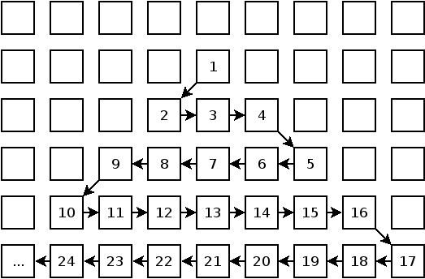

# Aufgabenblatt 0

## Aufgabe 0
Machen Sie sich mit den Bewertungsgrundlagen und den Abgabemodalitäten am Ende
des Aufgabenblatts vertraut. Richten Sie sich ein privates GitLab-Projekt für 
die Lehrveranstaltung ein und lassen Sie sich vom Übungsleiter \emph{gampe} 
Lese- und Schreibrechte geben und lassen Sie sich das von 
ihm bestätigen. 

Danach wird er in einem Ordner \textbf{blatt0} einen Unterordner 
\textbf{aufgabe} dieses Aufgabenblatt und weiteres Material in ihr Projekt ablegen.

Machen Sie sich des Weiteren mit dem Versionskontrollsystem \emph{git} vertraut.
Machen Sie es sich zur Gewohnheit, Ihre Lösungen von Vornherein unter 
Versionskontrolle zu entwickeln.

Legen Sie Ihre Lösungen für dieses Aufgabenblatt im ebenfalls bereits 
angelegten Unterordner \textbf{loesung} ab. 

## Aufgabe 1

Gegeben sei ein unendlich großes zweidimensionales Gitter aus 
Feldern, in denen Zahlen stehen können. Ausgehend von einem Feld, auf dem die
Zahl 1 steht, bilden sich serpentinenförmig alle natürlichen, positiven Zahlen
nach dem Muster in der obigen Abbildung. 

Gesucht ist die [Manhattan-Distanz](https://de.wikipedia.org/wiki/Manhattan-Metrik)
eines bestimmten Feldes zum Feld 1. 
Diese Distanz bestimmt sich aus der kleinsten Anzahl Schritte, die zurückgelegt 
werden müssen, wobei ein Schritt als eine Bewegung von einem Feld nach oben, 
unten, links oder rechts definiert ist.

Beispiele:
* Die Distanz von Feld 1 nach Feld 1 beträgt 0
* Die Distanz von Feld 12 nach Feld 1 beträgt 4 (einmal nach rechts, dreimal hoch)
* Die Distanz von Feld 24 nach Feld 1 beträgt 7 (dreimal nach rechts, viermal hoch)
* Die Distanz von Feld
  42125735164965854368050073056724536133137258177782014685412848415382136152669
  nach Feld 1 beträgt
  266363393931639635260776440815929105575,
  davon
  205245548465650904523442594168289305661
  Schritte hoch und
  61117845465988730737333846647639799914
  Schritte nach rechts.

Gestalten Sie Ihr Programm so, dass es eine Zahl von der Standardeingabe liest,
dessen Lösung berechnet und auf der Standardausgabe ausliefert. Das macht es
leichter, schnell unterschiedliche Eingaben zu testen und von außen die benötigte
Zeit zu messen.	

Der Zahlenwert des gesuchten Feldes befindet sich in der Datei *input* im 
Aufgabenverzeichnis. Testen Sie ihre Lösung auch mit anderen Zahlen.

## Bewertungsgrundlage
Die Bewertung der Abgabe besteht aus den folgenden Punkten, die ihr Lösungsprojekt
enthalten muss:

1. Eine schriftliche Ausarbeitung als PDF-Dokument in Ihrem GitLab-Projekt:
    1. Analyse des Problems. Behandeln Sie die folgenden Punkte:
        * Was macht das Problem kompliziert?
        * Skizzieren Sie, falls möglich, einen naiven brute-force Lösungsansatz 
            und ermitteln seine Laufzeit in O-Notation und seinen Speicherbedarf.
    2. Beschreiben Sie ihren Lösungsansatz
        * Beschreiben Sie eingesetzte Algorithmen/Lösungsstrategien und Datenstrukturen. Zitieren Sie Sekundärquellen, die zur Lösung beigetragen haben.
        * Ermitteln Sie die Laufzeit Ihrer Lösung in O-Notation.
        * Messen Sie die Laufzeit Ihres Programms auf einem Laborrechner der Hochschule. Verändern Sie, wenn es die Aufgabenstellung erlaubt, die Eingabegröße und messen Sie erneut.
2. Lösung der Problems in einem Projektordner in Ihrem GitLab-Projekt
    * Das *ausschließlich von Ihnen allein geschriebene* Programm soll die gestellte Aufgabe auf einem gewöhnlichen Laborrechner der Hochschule *in unter einer Minute Laufzeit lösen*.
    * Das Lösungsprojekt darf *nur als Quellcode abgegeben* werden. 
    * *Eine ausführliche Bau- und Ausführanleitung* ist zwingender Bestandteil 
      der Abgabe. Legen Sie gegebenenfalls Makefiles oder andere Bauskripte bei. 
      Das Bauen und Ausführen des Lösungsprojekts muss *in wenigen Schritten* 
      möglich sein und auf einem *Laborrechner der Hochschule vorgeführt* werden 
      können.
    * Ihr Programm darf *nur Ihre Lösung ausgeben*. Zusätzliche Ausgabe zu 
      Debuggingzwecken sind aus der Abgabe vorher zu entfernen. Falls Ihr 
      Programm hilfreiche Detailinformationen zur Lösungsfindung ausgeben kann, 
      dokumentieren Sie, wie sie gesondert aktiviert werden kann.

Seien Sie außerdem darauf vorbereitet, Ihr Projekt während des Praktikumstermins
vorzustellen und dazu Fragen zu beantworten.

## Abgabemodalitäten

Zur Abnahme ist die persönliche Anwesenheit erforderlich. Ihr Lösungsprojekt muss 
zum Abgabetermin im vorher von Ihnen eingerichtetem persönlichen, privaten 
GitLab-Projekt abrufbar sein.
